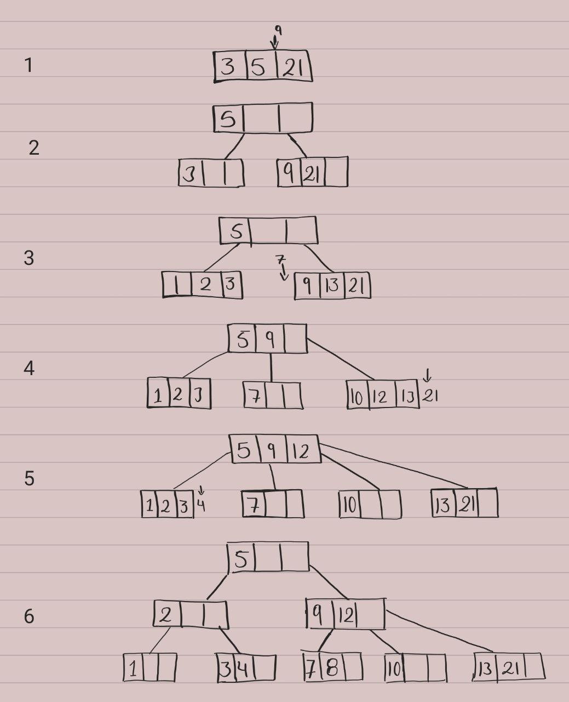
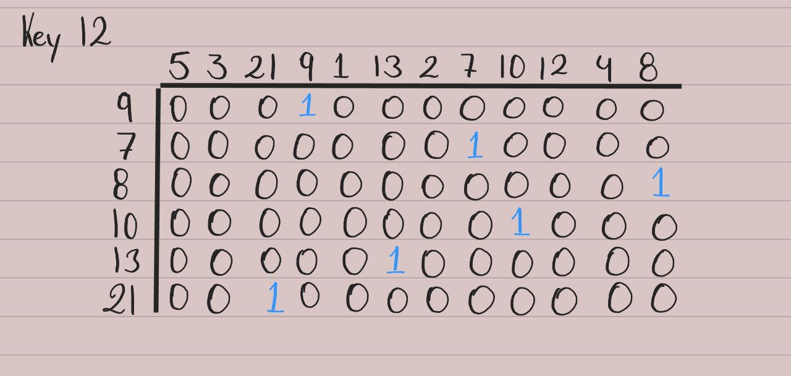

## Akurey-Test
### Implement the toMatrix() method. Such a method transforms the current BTree to an NxM matrix representation.

I was not able to develop the toMatrix() method, however I search how a Btree worked and understood the following example:

The list example is as follows 5,3,21,9,1,13,2,7,10,12,4,8.

- First I take 5,3 and 21 and ordered from highest to lowest.The order in this case is 4 so the Key would be 4-1 = 3.

- In the second step add 9, but in this case we have the 3 keys so we have to split the list. And put (5) (3,-,-) and (9,21,-)

- After add the number 13, occur the same case with 7. So we split again the tree and add 9 to the list of 5. Is the 3 step in the picture

- With 21 and 4 occur the same so we have to split the tree and you can see the result in the step 6

## Posible Solution:

What I would have done is while I am looking for the key in the tree, store in a list the brothers of that node, when find the key in that node, add the list to the matrix and continue with the elements of that list to search the left and right tree and to avoid going through the whole tree again, I would store the level of the key and the position where it is located. 

I imagine the matrix as a hash of 0 and 1 as the following image:

