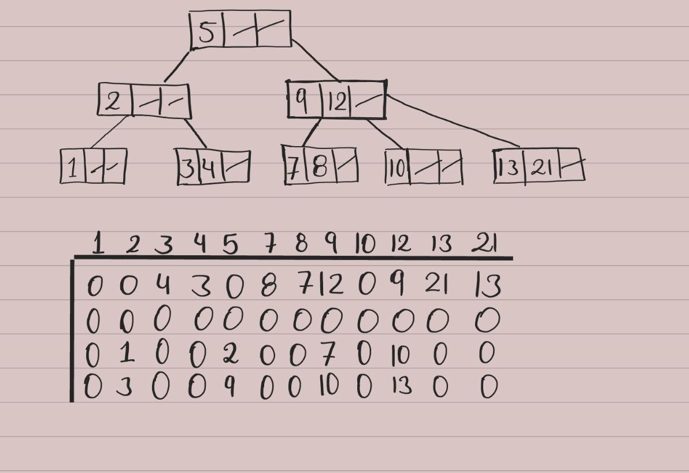

## Akurey-Test
### Implement the toMatrix() method. Such a method transforms the current BTree to an NxM matrix representation.

In the following examples I explain what I understood:

In the first example the order is 3, so the maximum number of keys per node is 2. To know the size of the matrix I perform the following calculation:

- N = (order - 2) + 2  #Rows

Formula by M:

The matrix has the size NxM = 4x80

The first rows will be the maximum of `keys - 1` because the key we are looking for is not counted, so in this case they can have 2 rows of brothers. The remaining rows are the left and right Btree. To represent the tree I decided to choose the first key of the node.

The second example is the same the order is 4, so the maximum number of keys per node is 3.  The size of the Matrix is 3x26.

**Importan Notes:**

- The keys must be greater than 0 since I decided to represent the empty spaces in the matrix with the number 0.

- I could not develop the right tree 

